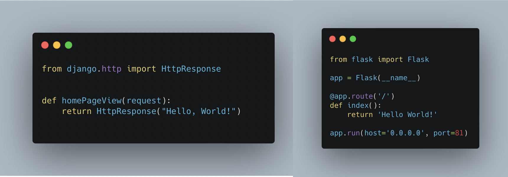
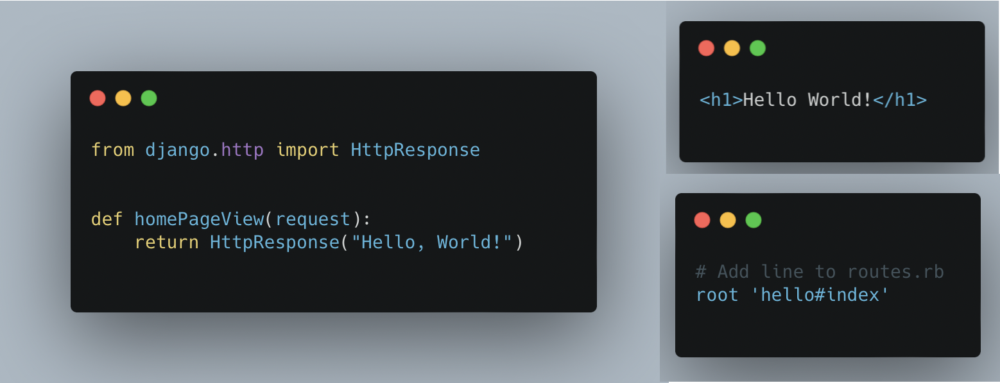
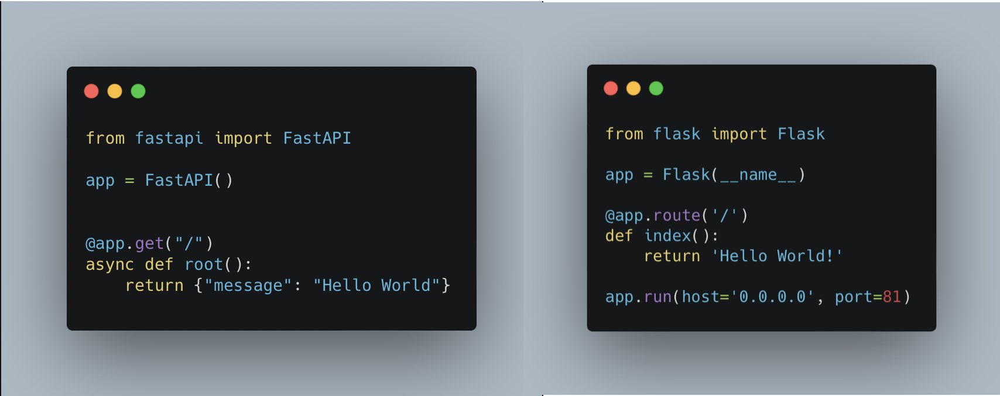

# Django vs. Flask vs. React vs. Node.js vs. FastAPI vs. Rails

Choosing the right technologies for a full-stack web application can be daunting with all the options out there. Let’s take a look at some of the most popular technologies, their uses and differences. 

## Django vs Flask

**Django** is a high-level web framework for Python, that comes with a lot of built-in features to help speed up web-development. Django provides common web features so that you don’t have to make them yourself. This is helpful when developing websites that need common features like admin interfaces, user authentication, and database connections.

**Flask** is a Python web framework that is designed for simplicity. Flask is a micro-framework, which means it has a simple core that you can build and extend if needed. This makes Flask ideal for small, unique web applications that do not require many common web features.

Consider Django if you are creating a large project that requires a lot of the common web features that Django provides. 

Consider Flask if you are looking to create a small, unique web application that is highly extendable and customisable.

## Django vs React

**Django** is a high-level web framework for Python with lots of built in features to help quickly develop large web applications. Django provides features like user authentication, admin interfaces, and database connectors to help speed up development. 

**React** is a free and open-source front-end Javascript library used for creating UIs. React allows you to create reusable components to use across your web application, reducing the time needed to code new components. It can be used to develop web applications as well as mobile applications with React native.

Consider Django if you are looking to quickly create large full-stack web applications with many features.

Consider React if you are familiar with Javascript and are looking for a library to assist in creating UIs for web or mobile applications

## Django vs Node.js

**Django** is a high-level web framework for Python that comes with common web features built-in. Django reduces the time needed when developing full-stack web applications by providing an infrastructure that you build your business logic onto of. That infrastructure includes features that provide safety, authentication, administration tools, database connections and more.

**Node.js** is a free and open source server environment that runs on the Javascript programming language. Node.js handles file requests and returns the content to the client. Use Node.js to generate dynamic page content, collect form data, perform CRUD operations in your database, and interact with files on your server.

Consider Django if you are looking to create a large web application that uses common web features that Django may provide “out of the box” like user authentication.

Consider Node.js if you are looking for an efficient and asynchronous server environment.

## Django vs FastAPI

**Django** is a web framework used to develop web applications quickly by providing an infrastructure to build you web applications on top of. It is written in Python which makes it an ideal web framework for web applications that make use of machine learning processing, as Python has many handy machine learning libraries that can be used within Django.

**FastAPI** is a web framework used for developing API’s in Python. FastAPI provides in built features that help save time when creating APIs, like automatic documentation, security, and authentication. FlaskAPI uses modern Python type declarations which helps reduce a learning curve if you are already familiar with the programming language.

Consider Django if you are creating a large project that requires a lot of the common web features that Django provides.

Consider FastAPI if you are looking to create an API and would like some in-built features to make the experience more efficient.

## Django vs Rails

**Django** is a high-level web framework for Python that comes with a lot of features that help speed up web-development. Some great built-in features include admin tools and user authentication. 

**Rails** is an open source web application framework written in the Ruby programming language. Rails, like Django, comes with a lot of in built features like an Object Relational Mapper, tools to work with the frontend (CoffeeScript), and controllers for interacting with the backend.

Consider Django if you want to save time on creating infrastructure so that you can focus on the business logic of your website. Also consider Django if you web application needs to process data using machine learning tools as Python comes with a lot of tools to handle this type of processing.

Consider Rails if you are looking to create a large web application and do not want to waste time on building infrastructure, as Rails provides this through built-in features.

## FastAPI vs Flask

**FastAPI** is a web framework used for developing API’s in Python. FastAPI provides in built features that help save time when creating APIs, like automatic documentation, security, and authentication.

**Flask** is a simple web framework used for developing lightweight and customisable web applications in Python

Consider FastAPI if you are looking to create an API and would like some in-built features to make the experience more efficient.

Consider Flask if you are looking to create a small, unique web application that is highly extendable and customisable.

## Flask vs React

**Flask** is a web framework used for creating simple and extensible web application in Python. It is much more lightweight (feature-light) making it very customisable when compared to other web frameworks.

**React** is a Javascript library that uses a component-based model for creating UIs. Components help to create reusable UI features, helping to reduce the time needed to code the front-end of an application.

Consider Flask if you are looking to create a small, unique web application that is highly extendable and customisable.

Consider React if you are familiar with Javascript and are looking for a library to assist in creating UIs for web or mobile applications

## Node.js vs React

**Node.js** is an efficient server environment that uses single-threaded and asynchronous programming. Use Node.js to perform CRUD operations, collect form data, and interact with files on a server.

**React** is a Javascript library that can help efficiently create UIs. React uses a components-based approach to creating UI features so that those features can be reused across your web application.

Consider Node.js if you are looking for an efficient and asynchronous server environment.

Consider React if you are familiar with Javascript and are looking for a library to assist in creating UIs for web or mobile applications

## Rails vs React

**Rails** is a web framework written in Ruby and comes with many built-in features. Rails’s built-in features provide an infrastructure of common web features, like an Object Relational Mapper.

**React** is a Javascript library that helps create reusable UI components for both web and mobile applications (React native).

Consider Rails if you are looking to create a large web application and do not want to waste time on building infrastructure, as Rails provides this through in-built features.

Consider React if you are familiar with Javascript and are looking for a library to assist in creating UIs for web or mobile applications.

