# Set up an S3 DVC Remote

Using S3 as [remote storage](https://dvc.org/doc/command-reference/remote) for
your <abbr>DVC projects</abbr> gives you a cost-efficient backend that can scale
up to petabytes.

In this guide, we'll show you how to

- Create a new S3 Bucket to use as your DVC remote
- Create IAM credentials to give DVC access to just this bucket
- Install the AWS CLI and DVC S3 extension locally
- Configure the AWS CLI with your IAM credentials
- Push your data up to S3 using DVC

## Quick start

If you already have a bucket and credentials set up, you can simply add the
remote using the short S3 format `s3://your-bucket-name-here`. For example

```dvc
$ dvc add data
...
$ dvc remote add --default myremote s3://your-bucket-name-here
$ dvc push
2 files pushed
```

If you need more detailed instructions, you can find a full walkthrough below
where we create all the required resources and configuration from scratch and
push some example data to S3. We assume you already have an AWS account and are
comfortable installing and using command line tools.

## Creating an S3 Bucket

Create a new bucket by logging into your AWS console. Then:

1. Navigate to the main S3 page.


2. Press **Create Bucket**.

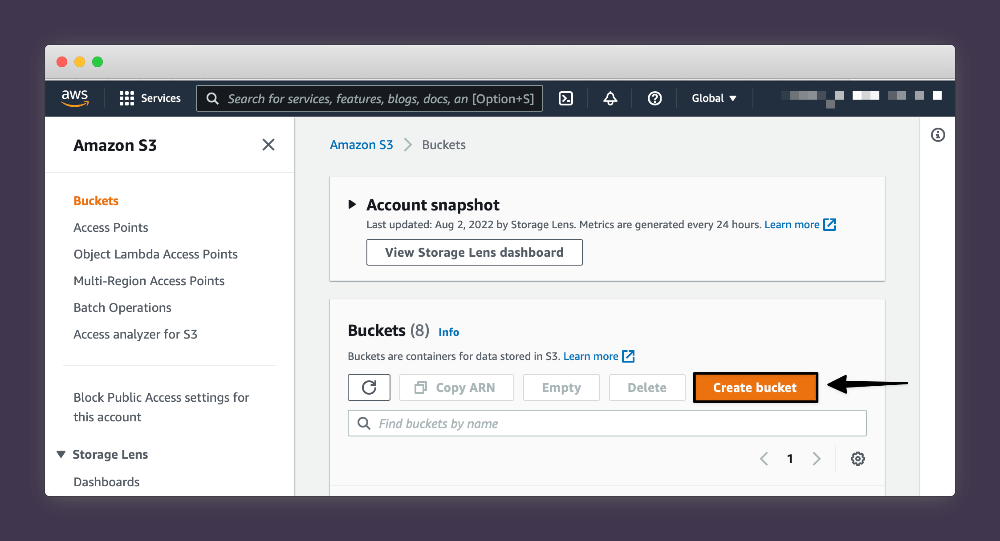

3. Choose a name for your bucket (note that S3 names have to be globally unique
   so be creative!).
1. Choose a region close to where you'll mainly be accessing and updating your
   data from.

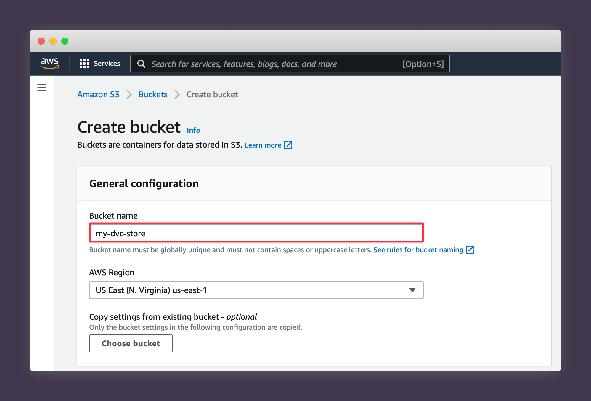

5. Scroll down to the bottom of the page and press **Create Bucket**.

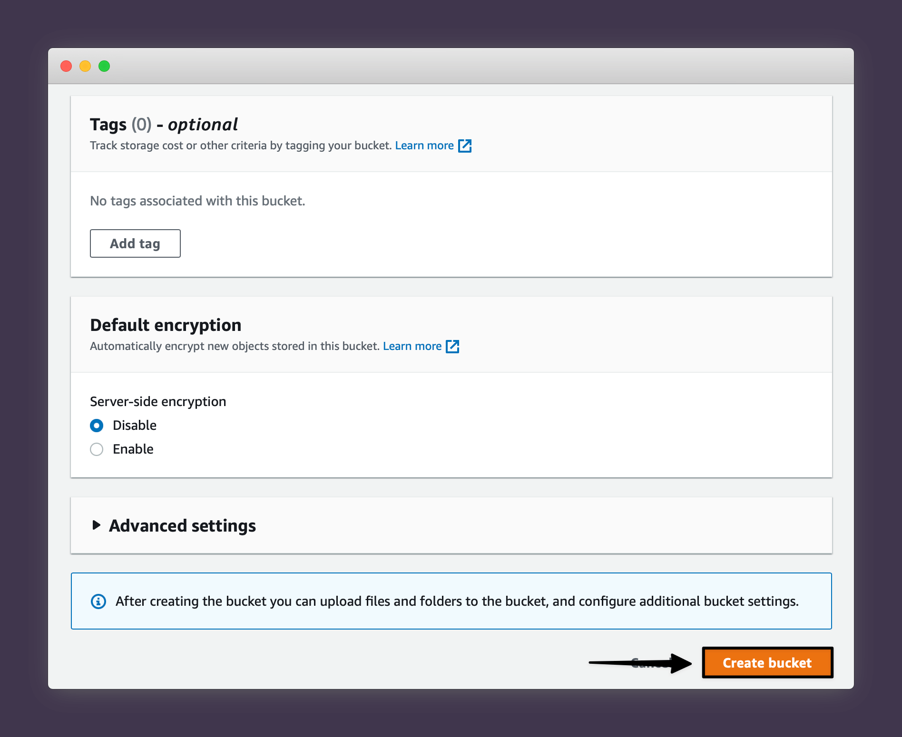

You should now see the bucket appear on your main S3 page.

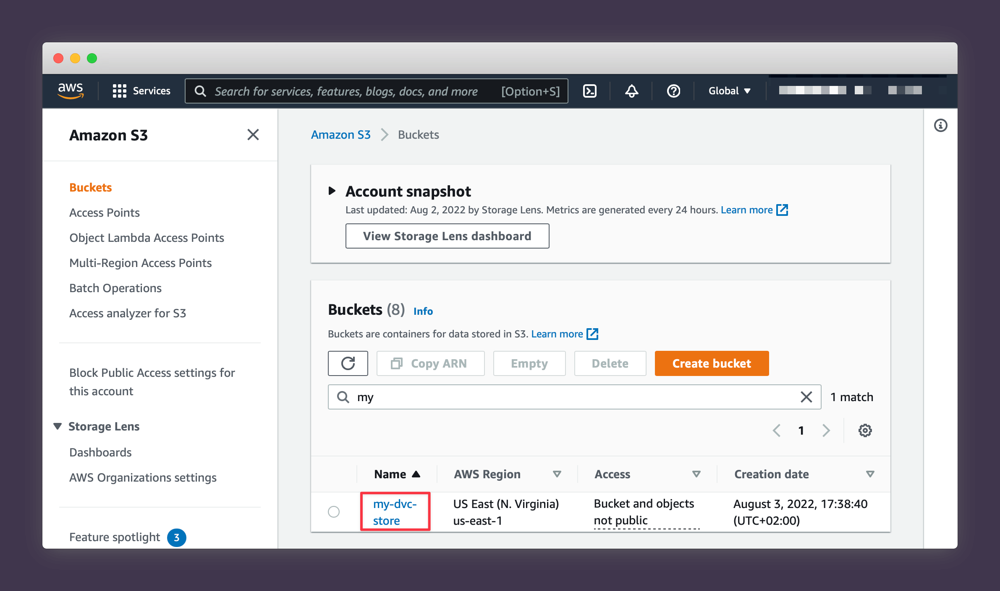

## Creating an IAM account and getting credentials

While you could use some existing AWS credentials, it's best to create a new IAM
user that only has access to the single S3 bucket you want to use as a DVC
remote, and use credentials for that. To achieve this:

1. Navigate to the main IAM page.


2. Press **Add Users**.

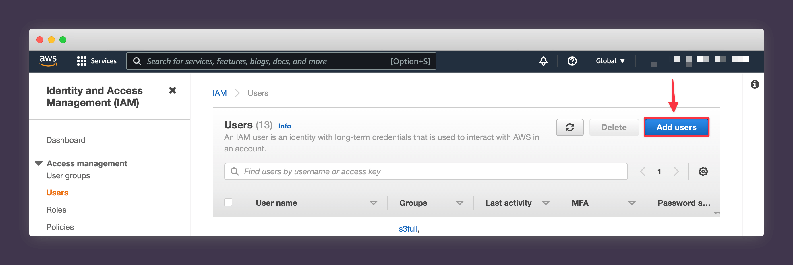

3. Name your User something like "dvcuser" and press **Next: Permissions**.

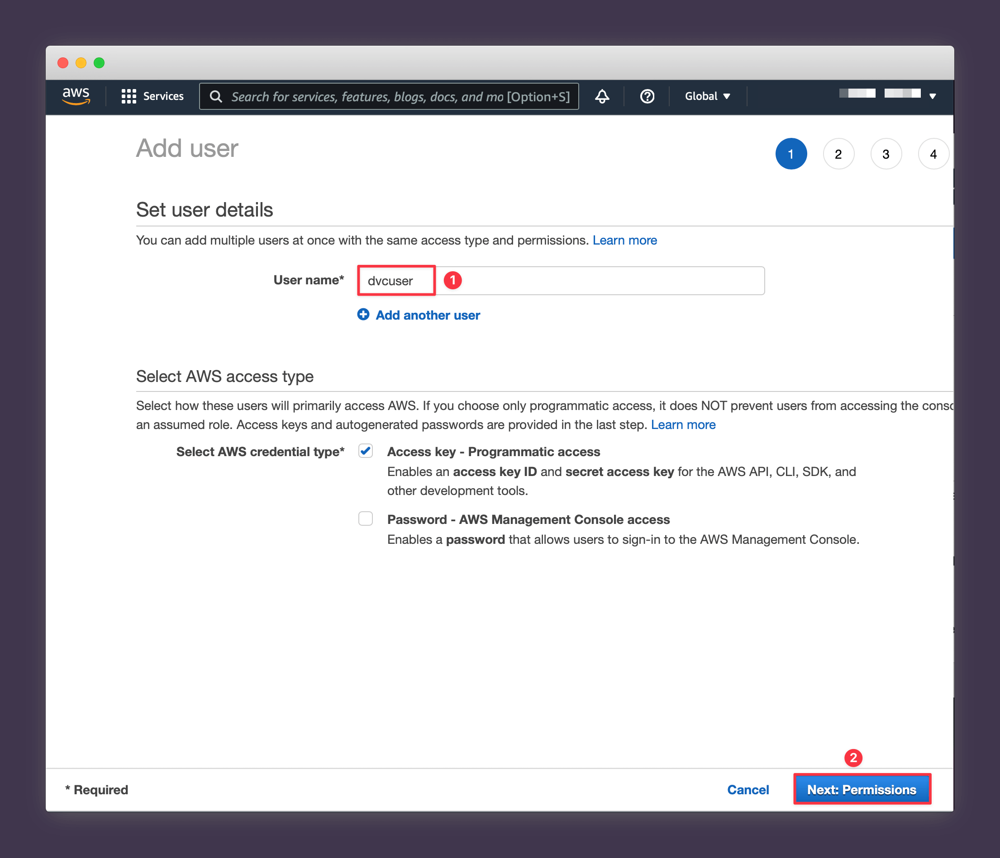

4. Choose **Attach existing policies directly** and press **Create policy**.

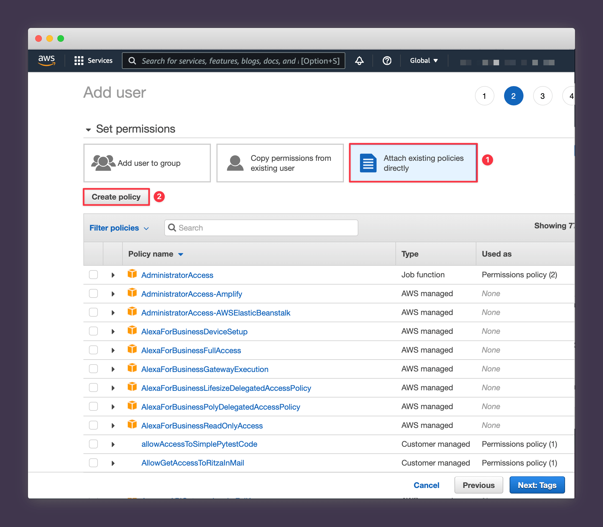

5. Select the **JSON** tab and paste the following policy. Note the **two**
   places where you need to substitute the bucket name you created earlier
   (we're using `my-dvc-store` in this example).

```json
{
  "Version": "2012-10-17",
  "Statement": [
    {
      "Effect": "Allow",
      "Action": ["s3:ListBucket"],
      "Resource": "arn:aws:s3:::my-dvc-store"
    },
    {
      "Effect": "Allow",
      "Action": ["s3:PutObject", "s3:GetObject"],
      "Resource": "arn:aws:s3:::my-dvc-store/*"
    }
  ]
}
```

Press **Next: Tags** when you're done.


6. Select **Next: Review**.


7. Give your policy a name like "AllowFullAccessMyDVCStore" and add a
   description to help you remember what it's for. Then press **Create policy**.

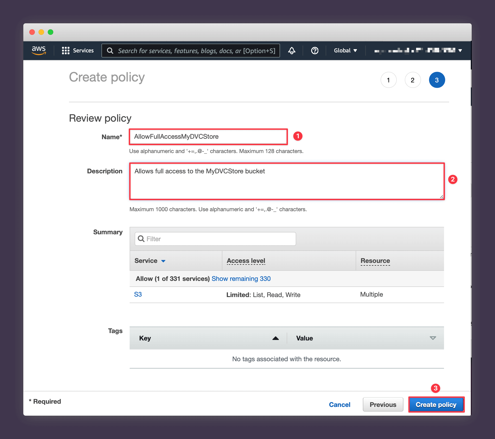

Close the tab and you should be taken back to your Create User flow. Press the
small refresh icon to bring in the new policy that you just created and then
search for it using the name you chose and press **Next: Tags**.


8. Press **Next: Review**.

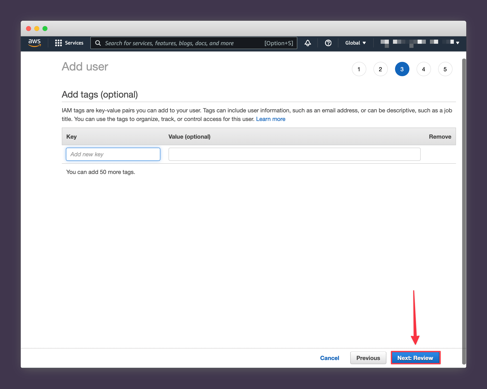

9. Press **Create User**.

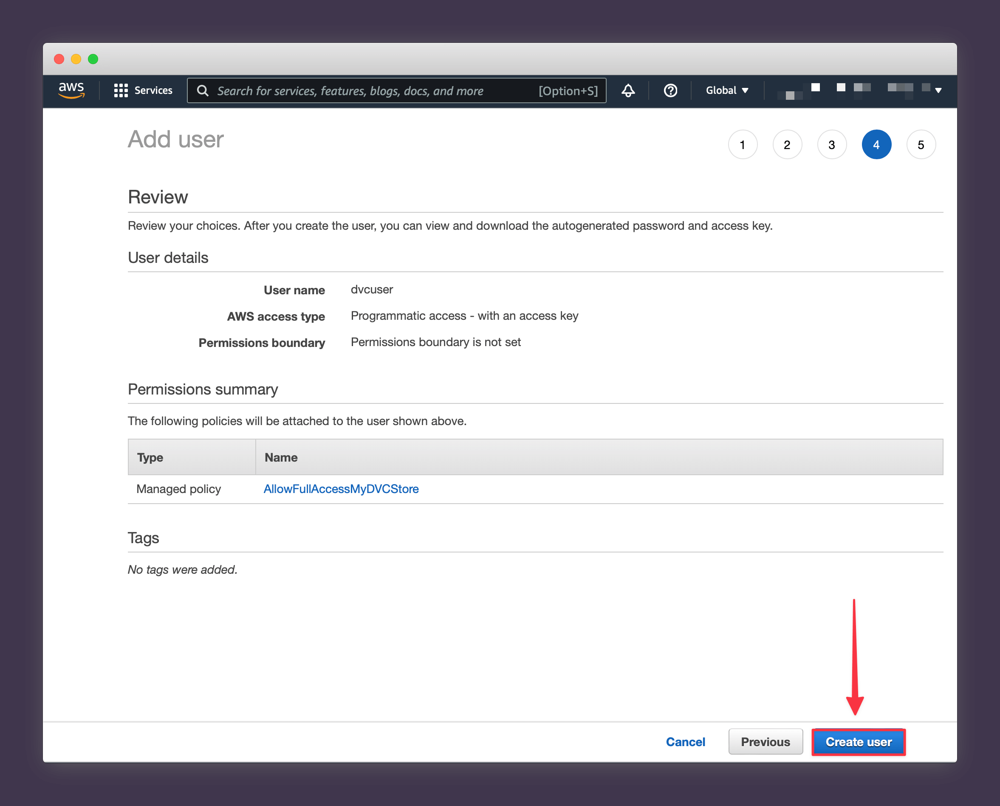

10. Reveal the generated secret key and save both the access key and secret key
    somewhere secure like your password manager (you won't be able to view your
    secret key from AWS again after this stage).

Once you've noted both values, close the page.

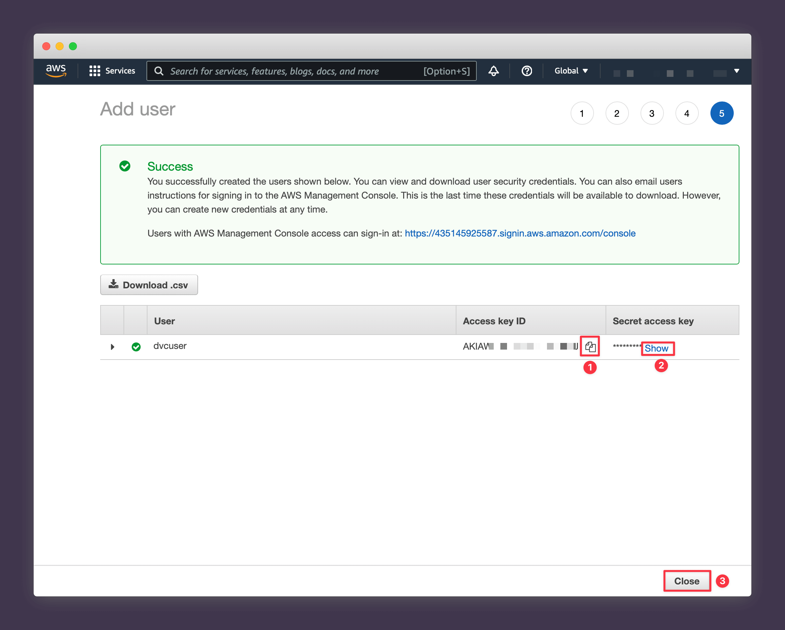

## Installing S3 for DVC and the AWS CLI

Let's set up a basic project from scratch with some fake data to use as a
demonstration. Run the following commands to

- create a new project folder
- create a virtual environment
- install the dependencies we need
- initialise git and DVC

```bash
mkdir dvc-s3-demo
cd dvc-s3-demo
python3 -m virtualenv venv
source venv/bin/activate
pip install 'dvc[s3]' awscli
git init
dvc init
```

Now let's:

- create a data folder and add some random data
- track this using DVC

```
mkdir data
head -n 10 /dev/random | base64 > data/datafile.dat
dvc add data
git add data.dvc
```

Now everything is tracked properly by DVC and we're ready to configure AWS with
the credentials we previously created and push data up to our S3 bucket.

## Configuring the CLI and pushing to S3

Type the command:

```
aws configure
```

And AWS will prompt you for your AWS Access Key ID and your AWS Secret Access
Key. Use the ones you copied previously associated with the IAM user that can
only access the DVC bucket. You can leave Default region name and Default output
format blank.

Configure the S3 bucket as the default DVC remote with the following command
(substitute in your own S3 bucket name).

```
dvc remote add --default datastore s3://my-dvc-store
```

And, finally, run

```
dvc push
```

to push your data to S3. Once you've made a few changes to your data and pushed
up different versions, you should see a bunch of subfolders appear in your AWS
bucket, as shown below. You can use DVC and git to navigate between different
versions by branch names and commit hashes, so you never have to worry about
overwriting a good dataset with bad revisions.


Well done! Now you have an S3 remote that can scale up as large as you need.

