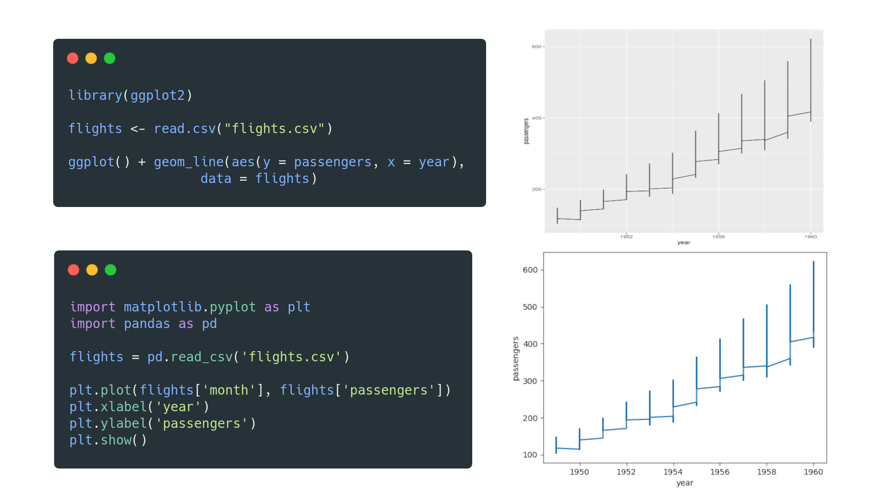
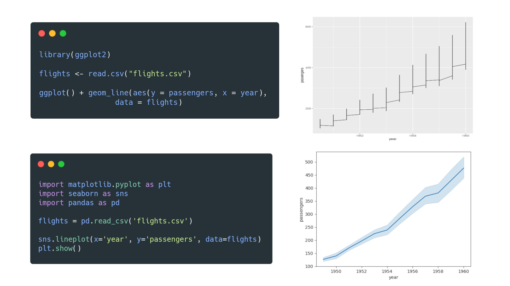

---
hide:
  - navigation
---

# Matplotlib vs. seaborn vs. plotly vs. MATLAB vs. ggplot2 vs. pandas
Nowadays, data almost always has to be visually represented, and numerous tools and packages 
exist for this purpose.
Let's look at the differences and use cases for the most recurrent visualization tools.

## Matplotlib vs. seaborn
Matplotlib is a commonly-used plotting package with continuous development and testing that 
offers numerous rendering back-ends, and uses a verbose syntax to create and style a large 
number of plots with a high degree of flexibility and customizability. 

seaborn is a python plotting library built on top of Matplotlib that allows for a concise but 
limited approach to quickly visualize data sets with better-looking style defaults than 
matplotlib.

Consider matplotlib if you want to create highly customized plots or are looking to learn the 
plotting tool behind seaborn.
Consider seaborn if you want to write concise code and create plots (especially statistical 
plots) with better-looking default styles in less time.

## Matplotlib vs. plotly
Matplotlib is an open-source plotting library for creating visualizations within Python that 
is more suited for initial exploratory analysis or minimalistic graph designs. 
Matplotlib is also designed to have similarities with MATLAB.

Plotly is a mostly open-source data analytics and visualization tool (with some closed-source 
products/services) that has support for interactive charts for web browsers and multiple 
languages such as Python, Julia, R, and MATLAB.

Consider Matplotlib if you want a fully open-source package or are looking for an interface 
with similarities to MATLAB if you are switching from MATLAB.
Consider plotly if you don't mind some closed-source packages or want to have your 
interactive data visualizations displayed on the web. If you use other programming languages 
besides Python, plotly's graphing library is more suitable.

## MATLAB vs. Matplotlib
MATLAB is a programming language dedicated to mathematical and technical computing through
the closed-source MATLAB IDE. MATLAB can also integrate with code written in other languages, 
such C, C++, Java, .NET and Python.

Matplotlib is an open-source plotting library written for and on the general-purpose Python 
programming language. Matplotlib is also designed to have similarities with MATLAB. However,
with matplotlib, performance issues can be observed when creating complicated plots.

Consider MATLAB if you are an engineer or scientist (not computer scientist) and you are able 
to pay for a MATLAB license.
Consider Matplotlib if you want an open-source library with versatility to reproduce graphs. 
Matplotlib also has the added benefit of using and having more algorithms created for Python.

## ggplot2 vs. Matplotlib
ggplot2 is a visualization library for the R programming language that lets users intuitively 
create graphs by declaring the desired output,
while matplotlib is a visualization library for the Python programming language that lets 
users specify how a graph should be produced.

Consider ggplot2 if you are using R and want a declarative or less verbose approach to 
creating plots. 
Consider matplotlib if you are relatively new to data visualization with Python or have more 
experience with Python rather than R.

## Matplotlib vs. pandas
Matplotlib is a visualization library that combines other libraries such as numpy and pandas 
to create visual representations of data,
while pandas is a library for mainly tabular data manipulation and analysis with built-in 
plotting functions that rely on matplotlib. 

Consider matplotlib on top of pandas if you want to have full control over your visualizations.
Consider only pandas if you want to organize and rearrange your data to create 
proof-of-concept visualizations without using other libraries explicitly.

## plotly vs. seaborn
plotly is half open-source analysis and visualization tool with support for web based, 3-D, 
and animated plots. plotly also allows for more customization, interactivity and language support.

seaborn is a fully open-source python visualization library built on top of matplotlib to 
create visually appealing plots quickly. seaborn does not have built-in 3-D and animation 
capabilities without the use of matplotlib.

Consider plotly if you use languages such as Python, R, MATLAB, Perl and Julia, or if you 
specifically want interactive or animated, web-based plots.
Consider seaborn if you want to quickly create visually appealing graphs with matplotlib 
functionality in the background.

## ggplot2 vs. seaborn
ggplot2 is a declarative plotting library for R that uses a layered approach to concisely 
describe graph components and build visualizations in a structured manner, 
while seaborn is an imperative plotting library for Python that builds matplotlib based 
visualizations with less code and some limitations.

Consider ggplot2 if you use R and want to rather define how your visualization should look 
than to describe the steps to create it. A similar approach for Python is also available with 
the "plotnine" package.
Consider seaborn if you use Python and want to create or have existing matplotlib visualizations. 
Seaborn will let you utilize matplotlib without having to interact with matplotlib much.

## pandas vs. seaborn
pandas is a Python library that provides a concise way to manipulate data in tabular format 
and has built-in plotting methods (with limited customization) that use matplotlib, 
while seaborn is a Python plotting library that functions as a wrapper around matplotlib.
seaborn integrates heavily with pandas to create visually appealing matplotlib graphs.

Consider only pandas if you want to manipulate your data and quickly build visualizations 
with no in-depth control over the visualization itself.
Consider seaborn with pandas if you want a full visualization package with more control and 
customizability.
